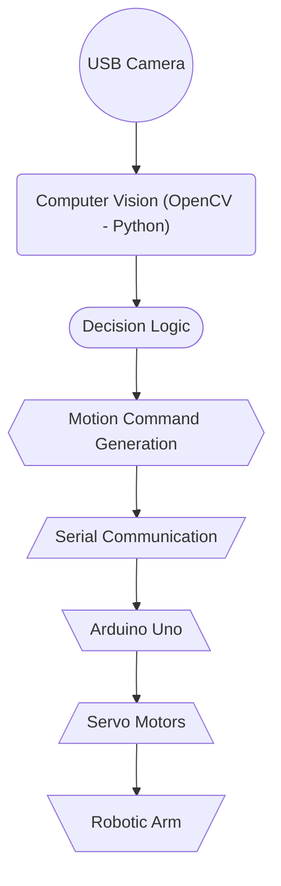

# Vision-Based Color Sorting Robotic Arm

This project demonstrates a **vision-based robotic arm system** capable of detecting object colors using a camera and autonomously performing pick-and-place sorting operations.
Unlike traditional robotic arms that rely only on fixed, pre-programmed positions, this system integrates **visual perception, decision-making logic, and smooth motion control** to decide when and where to move based on real-time observations.

The project is inspired by **industrial sorting systems**, where robots must adapt their actions based on sensor input rather than static assumptions.

---

## Demo

https://github.com/user-attachments/assets/58ca5c0b-6671-4cd8-b82f-40362ce6ed13

---

## System Architecture Overview


- **Vision and decision-making** are handled on the PC using Python
- **Real-time motor control** is handled by the Arduino
- Communication between the two is achieved using **serial communication**

---

## Hardware Components

| Component | Purpose  |
|---------------|-----------|
| 3D Printed Robotic Arm (Purchased)  | Mechanical structure for pick-and-place tasks |
| Arduino Uno | Controls servo motors and generates PWM signals |
| USB Camera | Captures live video of the workspace | 
| SG90 Servo Motors | Used for low-load joints |
| MG995 Servo Motors | Used for high-torque joints |
| SMPS (Switched Mode Power Supply) | Provides stable external power for servo motors | 

---

## Software Architecture

**Python (PC Side)**
- Captures live video from the USB camera
- Performs color detection using OpenCV
- Implements decision-making logic
- Generates smooth joint trajectories
- Sends joint angle commands to Arduino via serial communication

**Arduino (Microcontroller Side)**
- Receives joint angle commands
- Generates PWM signals
- Drives servo motors for each joint

---

## Computer Vision & Color Detection

The vision system uses **classical computer vision techniques** (not machine learning):

1. Capture frame from USB camera
2. Convert image from **BGR to HSV color space**
3. Apply color thresholding for Green and Blue
4. Perform morphological operations to reduce noise
5. Detect contours and filter by area
6. Estimate object position (left/right) to select target

HSV color space is used because it separates color information from illumination, making detection more robust to lighting variations.

---

## Motion Control & Teach-and-Repeat Mechanism

The robotic arm is controlled in joint space, not using inverse kinematics.

### Manual Teaching
- Joints are manually controlled using keyboard inputs
- Valid pick positions are recorded
- Positions are saved into a JSON file (targets01.json)

### Automated Execution
- Stored joint sequences are replayed during automation
- Smooth motion is achieved using linear interpolation between joint states
- This prevents jerky movements and reduces mechanical stress

This approach mirrors real-world teach-and-repeat industrial robots.

---

## Setup & Execution (Basic)

1. Upload arduino_code.ino to Arduino Uno
2. Connect servo motors and external SMPS
3. Connect USB camera to PC
4. Install Python dependencies:
```
pip install opencv-python numpy pyserial keyboard
```
5. Update the correct serial port in main_controller.py
6. Run:
```
python main_controller.py
```
---

## Future Improvements

- ROS2-based digital twin for simulation and testing
- Automatic color selection without user input
- Improved robustness under varying lighting conditions
- Inverse kinematics-based motion planning

---

## Team Members

- Kundan Bodkhe
- Chaitanya Belekar
- Arnab Nath
- Sanmitra Dhamane

---

## Final Note

This project emphasizes **practical robotics engineering**, combining perception, decision-making, and actuation into a working hardware system. It serves as a strong foundation for advanced robotics concepts such as simulation, kinematics, and ROS-based digital twins.

---
